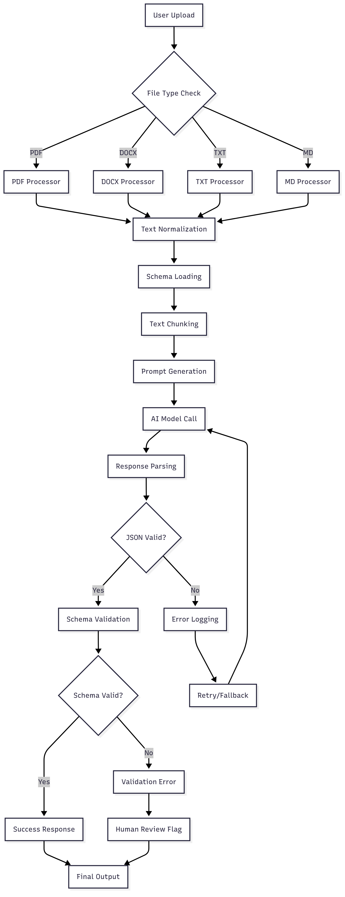

# AutoStruct
> Automatically convert messy, unstructured text into clean, structured JSON using AI

A AI system that can read messy, unstructured text (like emails or docs) and convert it into clean, structured JSON format, exactly matching a very detailed JSON schema

## Problem It Solves
In real business (B2B) workflows, companies often receive:
- Raw data like emails, PDFs, or chats,
- That contains requirements, notes, or discussions,
- Which need to be turned into structured data (JSON, CSV) for automation or tracking.
> Manual structuring is time-consuming — AutoStruct automates it.

## Features
- **Flexible Schema Support:** Handles JSON schemas with 3-7 levels of nesting, 50-150 nested objects, and up to 1,000 literals/enums
- **Multi-Format Input:** Supports PDF, DOCX, TXT, and MD  document formats
- **Intelligent Chunking:** Automatically splits large documents while preserving context
- **Schema Validation:** Strict validation against user-provided JSON schemas
- **Scalable Architecture:** Modular design for easy extension and maintenance

## FlowChart


## Setup
This project is already optimized for developement using VS Code Dev Containers providing isolated environment. 

1. **Clone the Repo**
    - Get the project locally using `git clone <repo_url>`.
2. **Docker**
    - Ensure Docker is installed and running before proceeding.
3. **Build the contaier** (ctrl + shift + p)
    - In VS Code, run `Dev Containers: Reopen in Container` to auto-build.
4. **Good to go!** 
    - Start coding inside the prebuilt environment — everything is set!
5. **Set up Gemini API key**
    ```bash 
        echo "GEMINI_API_KEY=your-actual-api-key-here" > .env
    ```

## Usage Guide
1. **Start the fastapi server**
    ```bash
    uvicorn app.main:app --reload
    ``` 
    **Available endpoints:**

    **POST** `/extract` 
    - Extracts structured data from uploaded documents according to provided JSON schema.

    **Parameters to be passed**:
    - `datafile`: UploadFile - The document to process (PDF, DOCX, TXT, MD)
    - `schemafile`: UploadFile - JSON schema file defining the expected output structure
2. **Usage**

    **Using Postman**
    1. Method: POST
    2. URL: http://localhost:8000/extract
    3. Body: form-data
        - Key: `datafile`, Type: File, Value: Select your file
        - Key: `schemafile`, Type: File, Value: Select schema.json 
    4. Send the request

## API Request Flow
